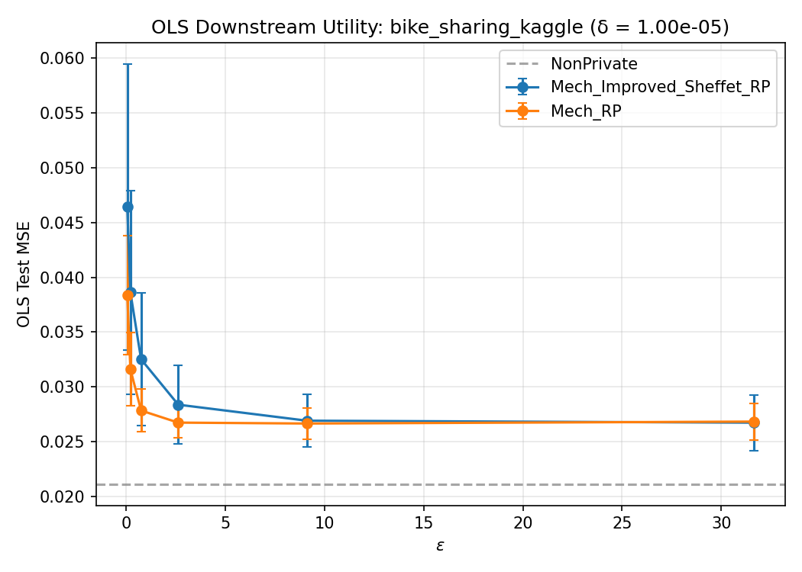
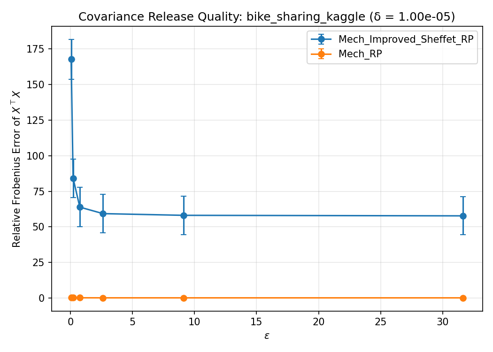

# WF-001 Demo Run Summary

**Dataset:** bike_sharing_kaggle  
**Mechanisms:** Mech_Improved_Sheffet_RP, Mech_RP  
**Task:** OLSFromRelease  
**Epsilon grid:** [0.063095734448, 0.218776162395, 0.758577575029, 2.6302679919, 9.12010839356, 31.6227766017]  
**Delta:** 1.00e-05  
**Seed batch:** mode=fixed, base_seed=50, count=20  
**Expanded seeds:** [232728459, 242120626, 264077156, 555690391, 722956788, 807043830, 849201880, 1297135640, 1881896573, 2174684847, 2320198210, 2632811854, 2851929981, 3184067578, 3200993824, 3207106906, 3270683069, 3361070606, 3442893482, 4207060628]  
**Trial indices:** [0, 1, 2, 3, 4, 5, 6, 7, 8, 9, 10, 11, 12, 13, 14, 15, 16, 17, 18, 19]  
**Total records:** 241  

**Non-private baseline test MSE:** 0.021104

## Results

See [summary_table_20260407-180307.csv](summary_table_20260407-180307.csv) for the aggregate table.

### OLS Downstream Task

### Covariance Release Quality

## Outputs

- Row-level results: `reports/bike_sharing_kaggle_improved_sheffet/demo_results.jsonl`
- Summary table: `summary_table_20260407-180307.csv`
- OLS figure: `ols_plot_eps_vs_mse_20260407-180307.png`
- Covariance figure: `covariance_plot_eps_vs_error_20260407-180307.png`
