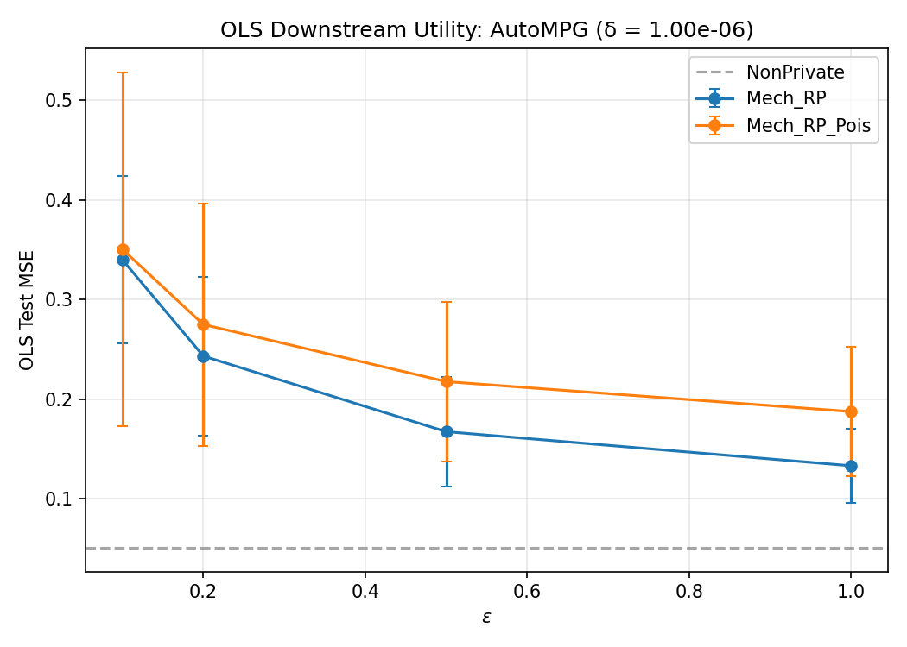
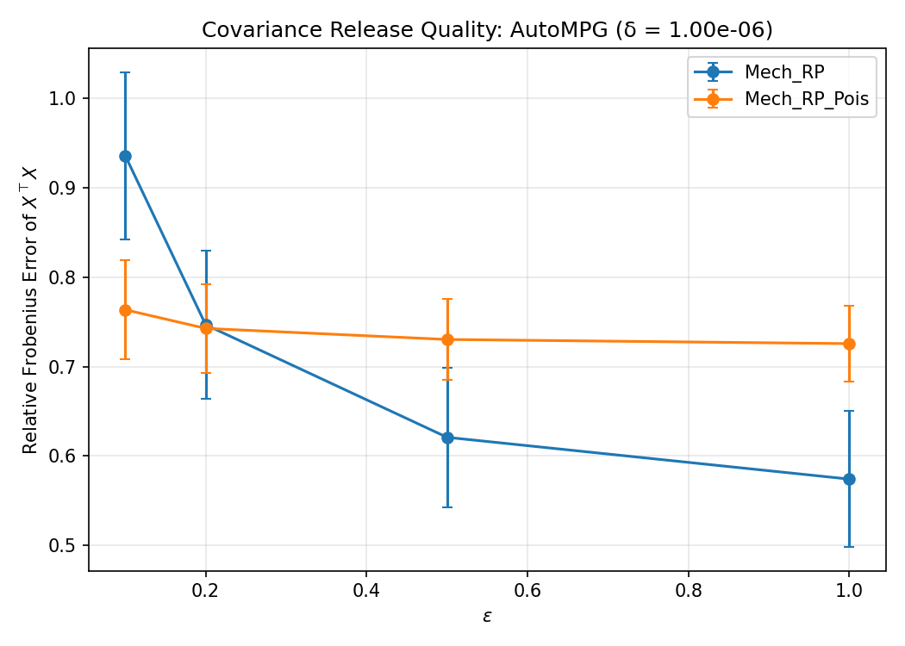

# WF-001 Demo Run Summary

**Dataset:** synthetic_redundant_regression  
**Mechanisms:** Mech_RP, Mech_RP_Pois  
**Task:** OLSFromRelease  
**Epsilon grid:** [0.1, 0.2, 0.5, 1.0]  
**Delta:** 1.00e-06  
**Seed batch:** mode=fixed, base_seed=0, count=10  
**Expanded seeds:** [161328693, 1369798745, 1874364848, 2214077229, 2613022947, 2617721224, 2968811710, 3026431988, 3141116543, 3964924996]  
**Trial indices:** [0, 1, 2, 3, 4, 5, 6, 7, 8, 9]  
**Total records:** 81  

**Non-private baseline test MSE:** 0.051028

## Results

See [summary_table.csv](summary_table.csv) for the aggregate table.

### OLS Downstream Task

### Covariance Release Quality

## Outputs

- Row-level results: `data/outputs/runs/demo_results.jsonl`
- Summary table: `summary_table.csv`
- OLS figure: `ols_plot_eps_vs_mse.png`
- Covariance figure: `covariance_plot_eps_vs_error.png`
