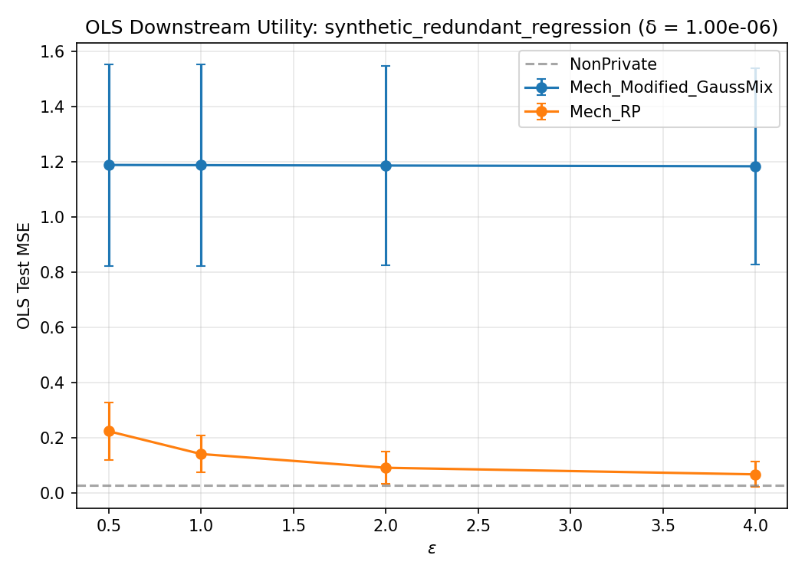
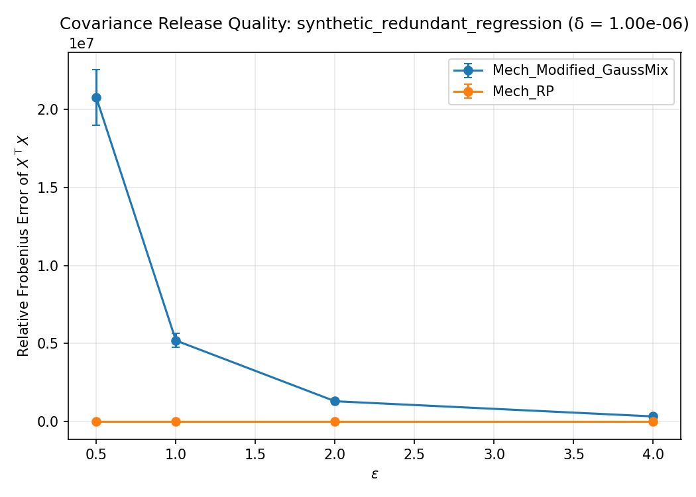

# WF-001 Demo Run Summary

**Dataset:** synthetic_redundant_regression  
**Mechanisms:** Mech_Modified_GaussMix, Mech_RP  
**Task:** OLSFromRelease  
**Epsilon grid:** [0.5, 1.0, 2.0, 4.0]  
**Delta:** 1.00e-06  
**Seed batch:** mode=fixed, base_seed=0, count=3  
**Expanded seeds:** [2968811710, 3141116543, 3964924996]  
**Trial indices:** [0, 1, 2]  
**Total records:** 25  

**Non-private baseline test MSE:** 0.028229

## Results

See [summary_table_20260407-230747.csv](summary_table_20260407-230747.csv) for the aggregate table.

### OLS Downstream Task

### Covariance Release Quality

## Outputs

- Row-level results: `reports/synthetic_rp_vs_modified_gaussmix/demo_results.jsonl`
- Summary table: `summary_table_20260407-230747.csv`
- OLS figure: `ols_plot_eps_vs_mse_20260407-230747.png`
- Covariance figure: `covariance_plot_eps_vs_error_20260407-230747.png`
