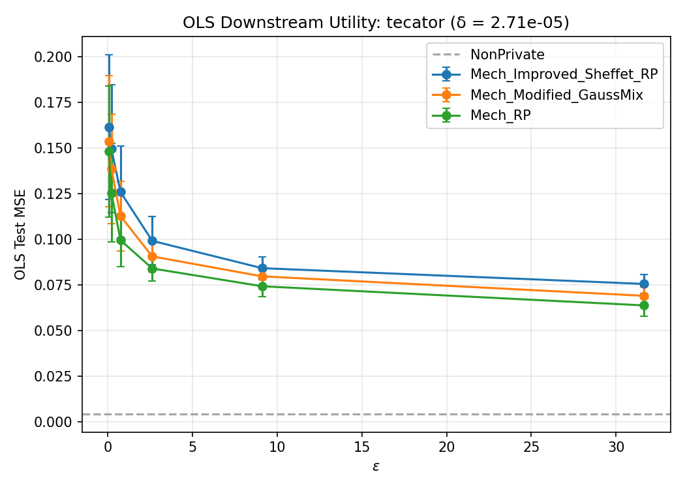
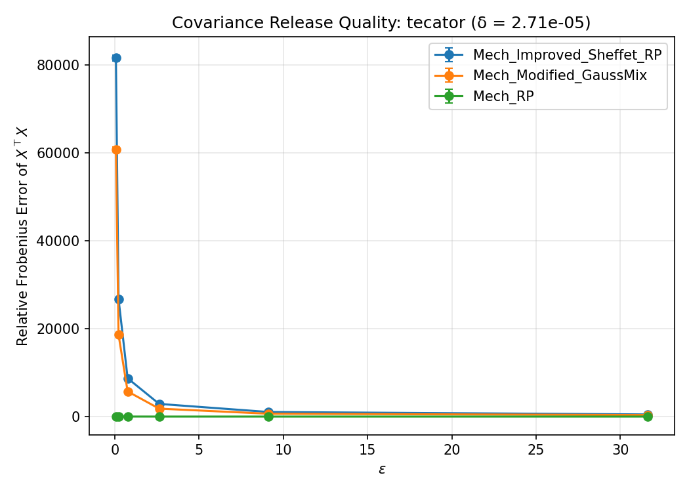

# WF-001 Demo Run Summary

**Dataset:** tecator  
**Mechanisms:** Mech_Improved_Sheffet_RP, Mech_Modified_GaussMix, Mech_RP  
**Task:** OLSFromRelease  
**Epsilon grid:** [0.063095734448, 0.218776162395, 0.758577575029, 2.6302679919, 9.12010839356, 31.6227766017]  
**Delta:** 2.71e-05  
**Seed batch:** mode=fixed, base_seed=50, count=250  
**Expanded seeds:** [38646746, 38724240, 41808154, 51574054, 60116750, 92432436, 119246226, 128971059, 220738420, 232728459, 242120626, 243547783, 245584689, 263012602, 264077156, 276177029, 302192262, 351746098, 353341827, 358323583, 405317651, 427863943, 439482722, 483189710, 517565270, 518156013, 554393033, 555690391, 569228843, 577868886, 583430943, 595120935, 609348967, 632151963, 633296251, 660981328, 691367097, 722956788, 741934110, 750449245, 760374058, 807043830, 818753896, 838035744, 844120824, 849201880, 872045820, 875992187, 878593229, 882266065, 892048929, 895271166, 908990024, 945871180, 963749412, 1019155906, 1021330672, 1023133818, 1060960117, 1103636601, 1132657402, 1143237734, 1161069576, 1188683659, 1192910069, 1204501984, 1213992168, 1243328282, 1251661429, 1252466901, 1260552484, 1278299267, 1297135640, 1321878148, 1333647485, 1337250491, 1353828832, 1366568899, 1380800477, 1414051660, 1414389975, 1458732696, 1459003289, 1485466509, 1498752837, 1498943685, 1504998156, 1505828164, 1516997993, 1524928873, 1527080731, 1528344364, 1534621843, 1535428656, 1541119788, 1543651419, 1551962213, 1569661885, 1571570852, 1597587446, 1604447852, 1623986173, 1638602658, 1643325943, 1648308348, 1676058065, 1679436612, 1696750092, 1719397902, 1785413268, 1793444522, 1878265160, 1881896573, 1885186912, 1895959650, 1921160143, 1951021897, 1959733160, 1961848187, 1962989863, 1972137135, 1989277295, 1990765412, 2022768742, 2031493326, 2060599067, 2074727979, 2083837018, 2084919056, 2130468865, 2137893423, 2163821863, 2167335028, 2169237825, 2173373979, 2174684847, 2216333164, 2225858223, 2233213379, 2315288291, 2320198210, 2328214628, 2416046902, 2439998204, 2459696931, 2504546113, 2514214331, 2518205578, 2519297194, 2525815496, 2527907771, 2530034123, 2579379210, 2592607678, 2604392250, 2632811854, 2694078224, 2704412785, 2706941399, 2717322040, 2726821048, 2739704640, 2746004203, 2785109883, 2799257320, 2824179801, 2851929981, 2884707617, 2886234850, 2892501229, 2898591964, 2901591045, 2917675967, 2951259121, 2968632416, 2979600713, 2994957501, 3001348669, 3016583680, 3019626847, 3024419027, 3060528292, 3074948327, 3078475689, 3086476595, 3088984414, 3098171218, 3149978375, 3168210367, 3171083919, 3184020719, 3184067578, 3200993824, 3203656508, 3207106906, 3229733105, 3232272292, 3248961294, 3255453147, 3270683069, 3272534195, 3277079821, 3280103615, 3288406546, 3291292719, 3298931989, 3300535409, 3307685543, 3339430274, 3361070606, 3377008813, 3391916594, 3409138323, 3436241736, 3442893482, 3470841578, 3488031759, 3531750692, 3552176294, 3557501177, 3566196438, 3592213938, 3605276929, 3607836791, 3616683550, 3621674113, 3622700228, 3667161691, 3681256702, 3728348477, 3770205437, 3797088197, 3857304085, 3891442512, 3902848794, 3905405091, 3912527392, 3913968690, 3949473187, 3961562677, 3963605978, 3973878722, 4011880340, 4045443815, 4059093714, 4185896289, 4196759945, 4197970975, 4207060628, 4277411001]  
**Trial indices:** [0, 1, 2, 3, 4, 5, 6, 7, 8, 9, 10, 11, 12, 13, 14, 15, 16, 17, 18, 19, 20, 21, 22, 23, 24, 25, 26, 27, 28, 29, 30, 31, 32, 33, 34, 35, 36, 37, 38, 39, 40, 41, 42, 43, 44, 45, 46, 47, 48, 49, 50, 51, 52, 53, 54, 55, 56, 57, 58, 59, 60, 61, 62, 63, 64, 65, 66, 67, 68, 69, 70, 71, 72, 73, 74, 75, 76, 77, 78, 79, 80, 81, 82, 83, 84, 85, 86, 87, 88, 89, 90, 91, 92, 93, 94, 95, 96, 97, 98, 99, 100, 101, 102, 103, 104, 105, 106, 107, 108, 109, 110, 111, 112, 113, 114, 115, 116, 117, 118, 119, 120, 121, 122, 123, 124, 125, 126, 127, 128, 129, 130, 131, 132, 133, 134, 135, 136, 137, 138, 139, 140, 141, 142, 143, 144, 145, 146, 147, 148, 149, 150, 151, 152, 153, 154, 155, 156, 157, 158, 159, 160, 161, 162, 163, 164, 165, 166, 167, 168, 169, 170, 171, 172, 173, 174, 175, 176, 177, 178, 179, 180, 181, 182, 183, 184, 185, 186, 187, 188, 189, 190, 191, 192, 193, 194, 195, 196, 197, 198, 199, 200, 201, 202, 203, 204, 205, 206, 207, 208, 209, 210, 211, 212, 213, 214, 215, 216, 217, 218, 219, 220, 221, 222, 223, 224, 225, 226, 227, 228, 229, 230, 231, 232, 233, 234, 235, 236, 237, 238, 239, 240, 241, 242, 243, 244, 245, 246, 247, 248, 249]  
**Total records:** 4501  

**Non-private baseline test MSE:** 0.004153

## Results

See [summary_table_20260409-184121.csv](summary_table_20260409-184121.csv) for the aggregate table.

### OLS Downstream Task

### Covariance Release Quality

## Outputs

- Row-level results: `reports/tecator/demo_results.jsonl`
- Summary table: `summary_table_20260409-184121.csv`
- OLS figure: `ols_plot_eps_vs_mse_20260409-184121.png`
- Covariance figure: `covariance_plot_eps_vs_error_20260409-184121.png`
